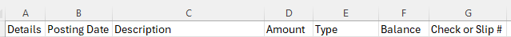
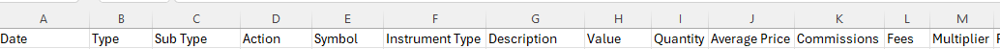

# CSV to QIF Converter

This is a Python program to take a CSV file and convert it to a QIF file. QIF is an 
open specification for reading and writing financial data.

This fork is a major rework of the original
written by Mario Avenoso of mtechcreations.com.
It keeps the concept of
"input-file" "output-file" "definition-file".
But the definition file is now json and has more readability and flexibility.

The as-is program and definition files will likely not just work for your CSV file.
Hopefully, you can get a working QIF file by modifying just the definition file.
But a willingness to tinker with the Python code 
and some familiarity with the QIF specification will go a long way
to reaching your goal. 
A mostly complete 1999 QIF format file is included in this repository
and there's info at [wikipedia](https://en.wikipedia.org/wiki/Quicken_Interchange_Format).

While most of the investment account fields are used for typical investment
transactions like buying and selling stock, many of the banking account
fields are generally not found in in your checking account CSV download.
They are included here anyway but have not been tested.

## Usage

python CSV-to-QIF.py [file-to-convert.csv] [converted-file.qif] [discription.json]

The description file is a json specification of how to convert the CSV file.

## Json File
The program already supports the name/value entries in the
`self.fields` and `self.ids` arrays in the Python record definitions.

The example Chase.json file converts a CSV file downloaded from Chase Bank
(at least as of this writing). The first line of the CSV file looks like this:

The example TW.json file converts a CSV file downloaded from TastyWorks brokerage
(at least as of this writing). The first line of the CSV file looks like this:

If more fields are added to the json file than are listed in the records'
`self.fields` and `self.ids`, the Python code would need
to be modified to support them.

The json file consists of several sections as described below.

### First Section (Required)
The first section specifies how to find the desired columns in the csv file.
The program makes a dictionary entry for each json `Name` in this section.

Just as a hint to usage, names that are capitalized (for example "Separator")
are used to control interpretion of the file but do not directly become QIF entries.
The recognized controls are:

|Name | Usage |
|-----|-------|
|Separator|Column separator character in the csv file. Defaults to ','|
|StartLine|Line number of the first line to convert. Defaults to 1 to process the first line. An entry of 2 would skip a header line.|
|CsvTimeFormat|Required. How to parse the date/time in the CSV file. (ref. [Python datetime](https://docs.python.org/3/library/datetime.html#strftime-and-strptime-behavior)).|
|QifTimeFormat|How to output the date/time to the QIF file. Defaults to "%d/%m/%Y". (ref. [Python datetime](https://docs.python.org/3/library/datetime.html#strftime-and-strptime-behavior)).|

The lowercase json `Names` represent actual QIF identifiers.

The program will generate the QIF "!Account" record if the "account" name/value pair is present.
The "accountType" is optional and defaults to "Bank".
If there is an "!Account" record and also a "balance" name/value pair (as in the Chase.json example),
the program will scan the CSV file for the "balance" value with the
latest date and use that to make a "$" entry in the "!Account" record.

The other name/value pairs associate the column in the CSV file with the QIF item.
The value is the column header letter when the CSV file is opened in a spreadsheet.
(The program will need modification if there are more than 'Z' columns.)

The example TW.json also illustrates some issues with that particular download file:
* There is no entry for the security name. 
e.g. the symbol MSFT is found in a column `E`, but the name "Microsoft Inc." is not in a column.
This complicates the generation of the QIF `!Type:Security` record.
So the workaround is to use the symbol column `E` 
for the name, symbol, and security to make the `!Type:Security` and `!Type:Invst` lists.
* The total fees are split between two columns, so the json defines a "Fees" column
so we can do the math (ref. [CalculationRules](#calculationrules-section-optional)).
* The "quantity" column is the number of options if the security is an option.
For the QIF, the quantity needs to represent the number of shares.
So the json defines the "Multiplier" column so we can do the math
(ref. [CalculationRules](#calculationrules-section-optional)).

### ActionMap Section (Investment Accounts)
This section defines the translation between the "action"
as defined in the CSV file the the actions that QIF recognizes.
For example, in the TW.json file, if the csv column `C` contains "Buy to Open", 
it is translated to a QIF "NBuy" record.

An entry of "prompt" causes the program to ask the user for the
QIF action code for that record.
The TW.json file has "prompt" for records where there is
not enough information on an individual CSV line to determine what happened.

### SecurityTypeMap Section (Investment Accounts)
This section defines the translation between the CSV security type
and the QIF `!Type:Security` security type.

If the account in an investment account, the program makes a pass
through the CSV file to collect the list of securities.

### InvertRules Section (Optional)
This section provides a means to change the sign on specified CSV entries
when generating the corresponding QIF output.

The field to change is specified as the name of the name/value pair.

The condition under which the sign should be changed is entered as the 
value of the name/value pair.
This should look like the expression of a Python `if` statement.
If a field should always be inverted, the value would just be `True`.
Be sure the include the `self.` when referencing condition values.

The value is tested using the Python eval() function.
If it evaluates as `True`, the sign of the named field is inverted.

The TW.json file has a couple of examples.

### CalculationRules Section (Optional)
This section provides for calculating a QIF output from CSV inputs.
The Python code currently understands addition and multiplication of two inputs.

Calculations are performed before any [InvertRules](#invertrules-section-optional).

The json format is:
`"result-field": ["input-field", "operation", "input-field"]`

Suppored values for "operation" are "+" and "*".
The expression evaluation adds the `self.` to all parameters.
So for example an entry of `"commission": ["commission", "+", "Fees"]`
results in the operation `self.commission = self.commission + self.Fees`.

